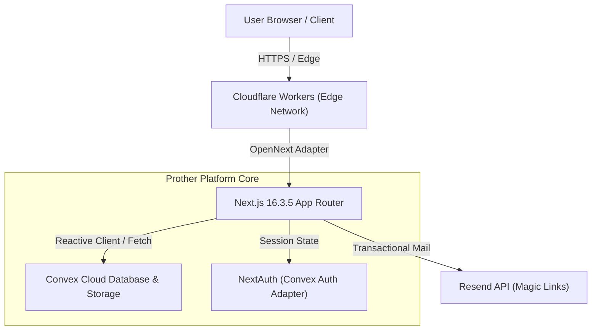

# Prother

<div align="center">


### **Where AI products launch & get discovered.**

A curated, human-reviewed directory of AI tools, platforms, and models. Built for honest discovery, transparent pricing, and side-by-side technical evaluation.

[](https://prother.dev)
[](https://nextjs.org/)
[](https://tailwindcss.com/)
[](https://convex.dev/)
[](https://workers.cloudflare.com/)
[](LICENSE)

[Explore Directory](https://prother.dev/tools) • [Compare Tools](https://prother.dev/compare) • [Read Journal](https://prother.dev/journal) • [Community Forums](https://prother.dev/forums) • [Submit a Tool](https://prother.dev/submit)

</div>

---

## ⚡ The Prother Philosophy

The AI landscape is flooded with pay-to-win directories, stale SEO link dumps, and misleading pricing tags. Prother was engineered to solve this through uncompromising editorial rigor:

- 🛡️ **Curation is never sold:** Placement and rankings cannot be bought.
- 🔍 **Honest pricing verified:** Every tool documents real free tier limits, subscription floors, and metered API costs.
- ⚖️ **The 6 Listing Standards:** Every single listed tool must pass six strict criteria:
  1. **S1 · Live & accessible:** Usable right now—no closed waitlists or "coming soon" teasers.
  2. **S2 · AI-native:** AI is the core capability, not a superficial feature toggle.
  3. **S3 · Complete listing:** Clear product documentation, working endpoints, and authentic developer attribution.
  4. **S4 · Honest presentation:** Transparent claims, zero fake "100% free" tags with hidden paywalls.
  5. **S5 · Safe & legal:** No abusive scrapers, malware, or model provider TOS violations.
  6. **S6 · English listing:** Standardized English descriptions and technical specifications.

---

## 🚀 Key Features

### 🔍 Scored Search & Command Palette (`⌘K`)
- Instant typeahead search indexed across tools, taxonomies, tags, and editorial articles.
- Global keyboard shortcuts: `⌘K` or `/` opens search, `⌘⇧E` opens Editor Review, and `⌘⇧A` opens Admin Console.
- Filter by pricing model (`Free`, `Freemium`, `Paid`, `Open Source`), categories, and verified APIs.

### ⚖️ Side-by-Side Comparison Matrix (`/compare`)
- Compare up to 4 AI tools in the same category on feature grids, pricing models, API availability, and community ratings.
- Persistent comparison tray docked at the bottom of the viewport for seamless browsing across listings.

### 📰 The Prother Journal & Live RSS (`/journal`, `/api/rss`)
- In-depth architectural writeups, ecosystem analyses, and developer evaluation guides.
- Full RSS 2.0 feed syndication at [`/api/rss`](https://prother.dev/api/rss).

### 💬 Community Forums (`/forums`)
- Threaded discussions organized into 4 rooms: General, Workflows, Pricing Feedback, and Makers.
- Upvoting, nested comment replies, markdown formatting, and verified maker badges.

### 📝 5-Step Submission Wizard (`/submit`)
- Real-time interactive preview card updating on every keystroke.
- Automatic duplicate domain checking against existing listings.
- Live submission moderation queue tracker with ticket lookups.

### 🌓 Dual Aesthetic System
- **Dark Mode (Brand default):** Ink Black (`#0A0A0A`), Ember Orange (`#FF6A00`), Coal (`#141312`), and canvas particle field.
- **Light Mode:** Warm paper palette (`#F2EEE4`) with high-contrast editorial typography and zero first-paint flash.

---

## 🏗️ Architecture & Tech Stack



| Layer | Technologies & Dependencies | Purpose |
| :--- | :--- | :--- |
| **Frontend Framework** | **Next.js 16.3.5** (App Router, Turbopack, RSC) | Server-side rendering, streaming metadata, and API routes |
| **Language & Engine** | **TypeScript 5**, **React 19**, **Bun** | High-performance type-safe runtime & bundling |
| **Styling & UI** | **Tailwind CSS v4**, **shadcn/ui** (Radix UI) | Responsive design tokens, atomic classes, accessible primitives |
| **Animations** | **Framer Motion 12**, Canvas Gateway Flow | Smooth view transitions, subtle micro-interactions |
| **Database & Realtime** | **Convex 1.46** | Serverless reactive database, document storage, and schema indexing |
| **Authentication** | **NextAuth 4** with Convex Adapter | Passwordless magic links & Google OAuth |
| **Edge Deployment** | **Cloudflare Workers** via `@opennextjs/cloudflare` | Zero-cold-start global edge hosting |

---

## 📁 Repository Structure

```text
├── convex/                     # Convex reactive backend
│   ├── schema.ts               # Database table schemas, indexes, and relations
│   ├── tools.ts                # Tool queries, mutations, search, and rankings
│   ├── posts.ts                # Journal articles and CMS editorial queries
│   ├── forums.ts               # Forum topics, replies, and upvote mutations
│   ├── submissions.ts          # Maker submission wizard queue & moderation
│   └── site.ts                 # Real-time CMS site configuration & KV settings
├── src/
│   ├── app/                    # Next.js App Router routes & API endpoints
│   │   ├── (routes)/           # /tools, /categories, /journal, /forums, /compare, /about
│   │   ├── api/                # Edge-ready API endpoints (rss, search, trending, feed)
│   │   ├── layout.tsx          # Root layout with providers and global overlays
│   │   └── globals.css         # Tailwind v4 theme declarations and brand color tokens
│   ├── components/
│   │   ├── prother/            # Prother feature components (Hero, SubmitWizard, CompareTray...)
│   │   └── ui/                 # Radix UI + shadcn accessible UI primitives
│   ├── lib/                    # Business logic, SEO generators, standards, Convex client
│   └── types/                  # Shared domain TypeScript definitions
├── docs/                       # Architectural specs, migration guides, and content strategies
└── open-next.config.ts         # Cloudflare Workers OpenNext configuration
```

---

## 🛠️ Getting Started

### Prerequisites

- [Bun](https://bun.sh/) (v1.1+ recommended) or Node.js (v20+)
- A [Convex](https://www.convex.dev/) account for the real-time backend
- [Cloudflare Wrangler CLI](https://developers.cloudflare.com/workers/wrangler/) (for edge deployments)

### 1. Clone the repository

```bash
git clone https://github.com/adeolaalabi2017/prother-dev.git
cd prother-dev
```

### 2. Install dependencies

```bash
bun install
```

### 3. Configure environment variables

Copy the sample environment file:

```bash
cp .env.example .env.local
```

Fill in your Convex and auth credentials in `.env.local`:

```bash
# Convex Deployment URL
NEXT_PUBLIC_CONVEX_URL="https://your-deployment.convex.cloud"

# Canonical URL
NEXT_PUBLIC_SITE_URL="http://localhost:3000"

# Authentication Store
AUTH_STORE="convex"
NEXTAUTH_SECRET="your-secure-random-secret"

# Resend API (for magic-link authentication)
RESEND_API_KEY="re_..."
EMAIL_FROM="Prother <login@prother.dev>"
```

### 4. Initialize Convex backend

In a separate terminal, launch the Convex development server:

```bash
bun run convex:dev
```

### 5. Start the Next.js development server

```bash
bun run dev
```

Open [http://localhost:3000](http://localhost:3000) in your browser to view the application.

---

## 📜 Available Scripts

| Command | Action |
| :--- | :--- |
| `bun run dev` | Starts Next.js development server on port 3000 |
| `bun run build` | Builds standalone Next.js production bundle |
| `bun run lint` | Runs ESLint across `src`, `convex`, and `scripts` |
| `bun run convex:dev` | Runs Convex cloud sync in development watch mode |
| `bun run cf:build` | Compiles Next.js application using OpenNext for Cloudflare Workers |
| `bun run cf:preview` | Builds and launches local Cloudflare `workerd` preview server |
| `bun run cf:deploy` | Builds and deploys the bundle directly to Cloudflare Workers |
| `bun run cf:typegen` | Generates type definitions for Cloudflare Worker bindings |

---

## 🌐 Edge Deployment (Cloudflare Workers)

Prother is fully serverless and runs on Cloudflare Workers using `@opennextjs/cloudflare`.

```bash
# 1. Verify Convex backend is deployed
bunx convex deploy --yes

# 2. Build and preview locally with workerd runtime
bun run cf:preview

# 3. Deploy to production
bun run cf:deploy
```

See [DEPLOY.md](DEPLOY.md) for detailed production checklists, secret configurations, and custom domain setup.

---

## 🤝 Contributing

We welcome contributions from the community! Whether you are fixing a UI bug, proposing a new AI listing standard, or adding directory features:

1. Read our [Contributing Guidelines](CONTRIBUTING.md).
2. Fork the repo and create your feature branch: `git checkout -b feature/amazing-feature`.
3. Ensure all tests and linters pass: `bun run lint`.
4. Commit your changes with descriptive messages: `git commit -m "feat: add keyboard shortcut for compare tray"`.
5. Open a Pull Request.

---

## 📄 License

This project is licensed under the MIT License — see the [LICENSE](LICENSE) file for details.

---

<div align="center">

Made with care for builders, researchers, and creators in the AI era.  
**[Prother.dev](https://prother.dev)**

</div>
