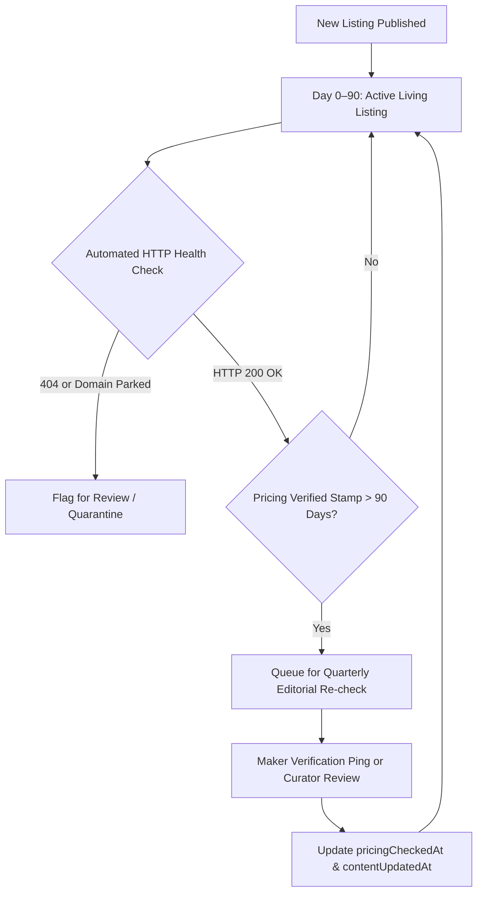

# Prother.dev — Content Strategy & Operational Checklist
*A high-signal, anti-slop content strategy and quality assurance framework for the AI Tools Directory.*

---

## 1. Executive Summary & Strategic Positioning

### The Market Landscape & The "Anti-Slop" Moat
Between 2023 and 2026, thousands of AI tool directories launched as low-effort affiliate link farms, rehashed scraping scripts, or abandoned weekend projects. Users and developers face widespread fatigue from:
- **Dead & Zombie Links**: Waitlist landing pages, unmaintained prototypes, or acquired/parked domains.
- **Pay-to-Win Bias**: Tools ranked by highest bid or affiliate commission rather than performance.
- **Hallucinated & Rehashed Marketing Copy**: Vague buzzwords ("unleash productivity", "game-changer") with zero technical substance.
- **Deceptive Pricing Labels**: Products branded as "Free" that demand a credit card for a 3-day trial or allow 3 prompts before a hard paywall.

### Prother's Strategic Positioning
Prother.dev is positioned as **the practitioner-grade discovery platform for AI software**. 

```
┌────────────────────────────────────────────────────────────────────────┐
│                          PROTHER.DEV MOAT                              │
├──────────────────────┬──────────────────────┬──────────────────────────┤
│ 1. Verified Listings │ 2. Developer Specs   │ 3. Living Freshness      │
│ 6 Published Standards│ API, SDK, GitHub,    │ Explicit pricing check   │
│ (S1-S6) verified     │ self-hosting, data   │ dates, changelog tracking│
│ before publish       │ retention posture    │ 90-day decay cycle       │
├──────────────────────┼──────────────────────┼──────────────────────────┤
│ 4. Honest Taxonomy   │ 5. Deep Editorial    │ 6. Zero Pay-to-Win       │
│ 7 durable categories │ Real pros, cons, use │ Organic discovery based  │
│ workflow-first       │ cases, and showdowns │ on utility and community │
└──────────────────────┴──────────────────────┴──────────────────────────┘
```

### Core Objectives
1. **Dominance in High-Intent Search**: Rank #1–#3 for high-intent long-tail discovery queries (`[tool] alternatives`, `[tool A] vs [tool B]`, `best AI [category] tools with API`).
2. **Practitioner Trust & High Retention**: Create pages worth bookmarking and revisiting during procurement, build-vs-buy decisions, and tool audits.
3. **Organic Distribution Flywheel**: Transform listed makers into advocates through verified badges, structured reviews, and changelog visibility.

---

## 2. Target Audience & Search Intent Architecture

### Audience Personas

| Persona | Primary Needs & Frustrations | Content Format They Consume |
| :--- | :--- | :--- |
| **The AI Engineer / Full-Stack Dev** | Needs API docs, SDK availability, token latency, self-hosted alternatives, context window limits, transparent pricing. | Tool Tech Specs, API tags, GitHub link verification, Head-to-Head Compare matrix. |
| **The "Vibecoder" & Indie Hacker** | Fast prototyping, agent orchestration, zero-config setups, avoiding vendor lock-in, knowing what actually works. | Collections ("Vibecoding Stack"), Forum discussions (`/forums`), practical 15-minute evaluations. |
| **The Tech Operator / SMB Lead** | Real workflow utility, team seat math, commercial licensing, data security/training data opt-out. | The Journal guides, detailed Pros & Cons, transparent pricing notes, Use Cases. |
| **The AI Tool Maker / Founder** | Clean, qualified developer distribution, fair presentation, claiming their profile. | Maker Claiming flow (`/claims`), verified maker badges, clear submission triage. |

### Search Intent Mapping

```
Top-of-Funnel (Informational)
├── The Journal: "How to Evaluate an AI Tool in 15 Minutes"
├── Category Guides: "State of Developer Frameworks & Infrastructure"
└── Taxonomy Deep-Dives: "Designing Category Taxonomies That Won't Rot"

Mid-of-Funnel (Commercial Investigation)
├── Category Hubs: /categories/conversational-ai
├── Filtered Hubs: /tools?category=dev-platforms&pricing=open_source&hasApi=true
└── Stacks / Collections: /collections/agentic-coding-stack

Bottom-of-Funnel (Transactional / Decision-Making)
├── Tool Profiles: /tools/cursor (Long description, pros/cons, verified pricing)
├── Head-to-Head Showdowns: /compare?a=cursor&b=windsurf
└── Alternatives Hubs: /tools/cursor#alternatives
```

---

## 3. The 5 Content Pillars

Prother's content ecosystem is built on five interconnected pillars:

### Pillar 1: High-Fidelity Tool Profiles (`/tools/[slug]`)
Every tool profile is an objective data sheet, not a marketing brochure.
- **Identity**: Clear name, 1-line honest tagline, clean square logo, verified website URL.
- **Editorial Overview**: 2–3 substantive paragraphs explaining what the tool does, who it is for, and how it handles underlying models or infra.
- **Structured Use Cases**: 2 to 4 concrete, actionable tasks (Title + brief explanation).
- **Hard Truths (Pros & Honest Cons)**: Balanced pros and at least 2 genuine limitations (e.g. credit consumption, lack of API, rate limits, lock-in).
- **Developer Specs**: `hasApi` badge, `docsUrl`, `githubUrl`, `pricingModel`, `startingPrice`, and `pricingNote`.
- **Verification Stamp**: `pricingCheckedAt` timestamp ("Pricing verified on Sep 23, 2026").

### Pillar 2: Head-to-Head Comparisons & Alternative Engines (`/compare`)
Side-by-side matrices answering the universal buyer question: *"Which one should I use?"*
- Feature-by-feature comparison (API availability, open source status, pricing model).
- Real trade-off summaries: When to choose Tool A over Tool B.
- Direct links back to primary category and sibling alternatives.

### Pillar 3: Workflow Stacks & Curated Collections (`/collections/[slug]`)
Task-oriented collections that reflect real production setups rather than arbitrary lists:
- *Example*: "The Autonomous Coding Agent Stack" (Cursor + Claude 3.5 Sonnet + Aider + Langfuse).
- *Example*: "Local & Private AI Stack" (Ollama + Open WebUI + LiteLLM + Qdrant).
- Each collection includes context on how the tools integrate together.

### Pillar 4: The Journal (`/journal/[slug]`)
Long-form editorial essays, evaluation playbooks, and empirical teardowns:
- **Evaluation Playbooks**: Reproducible frameworks (e.g., "The 3-Task Test", "Data Retention Audit Checklist").
- **Ecosystem Analyses**: Objective state-of-the-industry reports on specific niches (e.g. Code generation, Voice agents, Vector databases).
- **Directory Transparency**: Insights into how Prother reviews tools, categorizes emerging agentic patterns, and handles listing standards.

### Pillar 5: Community & Maker Ecosystem (`/forums`, Claims & Reviews)
- **Community Forum**: Targeted discussion topics (`general`, `vibecoding`, `show`, `introduce`).
- **Verified Maker Claims**: Makers claim their profile, respond to comments with a "Maker" badge, and keep specs updated.
- **Multidimensional Reviews**: Ratings split into Ease, Power, and Value (out of 5), backed by soft moderation to prevent astroturfing.

---

## 4. Programmatic & Editorial SEO Blueprint

### Information Architecture & URL Hierarchy

| Route | Primary Target Keyword | Canonical & Indexing Rules |
| :--- | :--- | :--- |
| `/tools/[slug]` | `[Tool Name] AI`, `[Tool Name] pricing`, `[Tool Name] review` | Index, self-canonical. Structured `SoftwareApplication` JSON-LD. |
| `/compare?a=[slugA]&b=[slugB]` | `[Tool A] vs [Tool B]`, `[Tool A] alternative` | Index high-demand pairs; self-canonical to sorted slug order (`a < b`). |
| `/categories/[slug]` | `best AI tools for [category]`, `[category] software directory` | Index, self-canonical. Structured `CollectionPage` JSON-LD. |
| `/journal/[slug]` | Editorial long-tail keywords (e.g., `how to evaluate AI tools`) | Index, self-canonical. Structured `BlogPosting` JSON-LD. |
| `/collections/[slug]` | `[topic] AI stack`, `best tools for [use case]` | Index, self-canonical. |

### Technical SEO & Schema Standards
1. **Structured Data (JSON-LD)**:
   - Every tool profile MUST include `SoftwareApplication` schema with `name`, `description`, `applicationCategory`, `offers` (price, priceCurrency), and `aggregateRating` when reviews exist.
   - Every journal post MUST include `BlogPosting` schema with `headline`, `datePublished`, `dateModified`, `author`, and `publisher`.
2. **Metadata & OpenGraph**:
   - Dynamic `/api/og` endpoint generating high-contrast branded cards with title, category emoji, and tags.
   - Meta descriptions must be written concisely (140–155 characters) and contain factual specs (e.g., "Cursor is an AI-first code editor. Free plan available; Pro starts at $20/mo. Check API support, pros, and alternatives.").
3. **Internal Linking Geometry**:
   - Tool pages link to their 7 core category hubs and up to 6 sibling alternatives.
   - Journal articles explicitly link to reviewed tool profiles using semantic anchor text.
   - Category pages display top Editor's Picks and newest verified additions.

---

## 5. Content Freshness & Decay Prevention Strategy

The #1 failure mode of AI directories is stale data. Prother prevents decay through an automated-assisted maintenance cycle:



### 1. The 90-Day Freshness Cycle
- Every listing records `pricingCheckedAt` and `contentUpdatedAt`.
- Listings unverified for >90 days trigger an alert in the Admin Console.
- Verified badges explicitly state the verification month/year, establishing proof of recent human validation.

### 2. Automated Dead-Link & Redirect Guardrails
- Scheduled pinging checks `websiteUrl`, `docsUrl`, and `githubUrl`.
- Tools whose homepage redirects to a domain broker or returns a 4xx/5xx code for >7 consecutive days are moved to `draft` or `removed`.

### 3. Maker Claim Loops
- When a maker claims their tool via meta-tag or company email domain verification (`/claims`), they receive a quarterly notification to confirm or update their pricing tiers and API capabilities.

---

## 6. Editorial Style Guide (The Prother Voice)

### Core Voice Principles
1. **Empirical & Direct**: Write like an engineer writing an internal architecture evaluation. State what it does, what model it runs on (if known), and what it costs.
2. **Skeptical of Marketing Fluff**: Disregard vendor taglines claiming to "revolutionize workflows". Look at the inputs, the processing, and the outputs.
3. **Zero Decorative Typographic Slop**: Per Prother's codebase rules, **no em dashes (—) or en dashes (–)** in seed data or UI copy. Use colons, semicolons, parentheses, or clean periods.
4. **Honest Pricing Terminology**:
   - `free`: Completely free without payment requirements (e.g., open-source models, free tiers with real ongoing utility).
   - `freemium`: Permanent free tier with functional utility, plus paid tiers for advanced features/scale.
   - `paid`: Requires payment; trial periods with credit card required are `paid`, not `free`.
   - `open_source`: Permissive or public source repository available on GitHub/GitLab.

### Banned Buzzwords
- "Revolutionary", "Cutting-edge", "Game-changer"
- "Unleash the power of AI"
- "In today's fast-paced digital landscape"
- "Ultimate solution"
- "Seamless integration" (unless referring to a verified 1-click webhook/OAuth flow)

---

## 7. Operational Checklists

Use these practical checklists to maintain strict quality standards across all Prother operations.

### Checklist 1: Tool Intake & Screening (Standards S1–S6)

Run this checklist on every candidate tool before it enters the database:

- [ ] **S1: Live & Accessible**
  - [ ] The URL resolves to an active, working product.
  - [ ] Not a waitlist, landing page, "coming soon" flyer, or gated enterprise demo.
  - [ ] A self-serve signup or download is available immediately.
- [ ] **S2: AI-Native**
  - [ ] AI is the core functionality, not an incidental LLM wrapper slapped on a CRUD app.
  - [ ] Workflow delivers distinct value beyond raw model prompts.
- [ ] **S3: Complete Listing**
  - [ ] Clean product name without marketing appendages (e.g., "Cursor", not "Cursor: Best AI Code Editor").
  - [ ] Accurate 1-line tagline under 100 characters.
  - [ ] Working links for website, documentation, and (if applicable) GitHub repo.
  - [ ] Transparent pricing structure identified.
- [ ] **S4: Honest Presentation**
  - [ ] No fake "Free" labeling if the tool only offers a 3-day trial.
  - [ ] No fabricated reviews or inflated claims.
  - [ ] Commercial licensing clear for image/video generative models.
- [ ] **S5: Safe & Legal**
  - [ ] No phishing, credential scraping, or malware.
  - [ ] Compliant with upstream model provider Terms of Service (e.g. OpenAI, Anthropic).
- [ ] **S6: English Listing**
  - [ ] The listing copy, tags, and use cases are in clean English (tool may support other languages).

---

### Checklist 2: Tool Profile Enrichment (Admin Listing Editor)

Run this checklist when creating or editing a full tool profile (`/admin` / `ListingEditor`):

- [ ] **Taxonomy & Category Placement**
  - [ ] Assigned to exactly one of the 7 core categories:
    - `conversational-ai` (Assistants, chatbots, customer support agents)
    - `generative-content` (Image, video, audio, and code generation)
    - `nlp-text` (Summarization, translation, transcription, grammar)
    - `computer-vision` (Detection, classification, OCR, visual parsing)
    - `data-analytics` (Forecasting, BI copilots, CRM intelligence)
    - `automation` (Multi-step workflows, app integration, RPA)
    - `dev-platforms` (Frameworks, model serving, RAG, vector stores)
  - [ ] 2 to 5 specific tags assigned (e.g. `coding`, `agents`, `open-source`, `local-llm`).
- [ ] **Long Description (Editorial Depth)**
  - [ ] 2 to 4 detailed paragraphs (300–800 words).
  - [ ] Paragraph 1: What it is, target user, core mechanism/models used.
  - [ ] Paragraph 2: Key technical features and interface (CLI, Web, IDE extension, API).
  - [ ] Paragraph 3: Ideal fit vs who should avoid it.
  - [ ] No em/en dashes; adheres strictly to the Prother Style Guide.
- [ ] **Structured Use Cases**
  - [ ] 2 to 4 concrete use cases added.
  - [ ] Each has a concise action-oriented title (<= 80 chars, e.g. "Refactor legacy codebase").
  - [ ] Each has a clear explanation of the task flow (<= 400 chars).
- [ ] **Pros & Honest Cons**
  - [ ] Exactly 3 to 4 distinct strengths (Pros).
  - [ ] Exactly 2 to 4 honest limitations (Cons) — e.g., "High latency on large context windows", "Closed source", "Usage credits deplete quickly".
- [ ] **Alternatives Mapping**
  - [ ] 2 to 6 alternative tool slugs selected from within Prother's directory.
  - [ ] Verified that alternatives share the same primary use case.
- [ ] **Developer & Pricing Specs**
  - [ ] `pricingModel` accurately set (`free` | `freemium` | `paid` | `open_source`).
  - [ ] `startingPrice` filled (e.g., "$20/month", "Free / $15 per seat").
  - [ ] `pricingNote` details limits (e.g., "500 fast requests/mo, unlimited slow requests").
  - [ ] `hasApi` toggled correctly.
  - [ ] `pricingCheckedAt` switch toggled ON to stamp today's date.
- [ ] **Media Assets & Logo Invariant (Strict)**
  - [ ] Authentic vector logo (`public/logos/<slug>.svg`) or official high-res brand PNG (`public/logos/<slug>.png`) added.
  - [ ] `logoUrl` explicitly points to `/logos/<slug>.<ext>` in both Convex and SQLite.
  - [ ] Never use generic AI icons, emoji tiles, or Convex internal storage IDs (`kg2...`).
  - [ ] At least 1 clear product screenshot added (high resolution, no marketing popups).

---

### Checklist 3: Head-to-Head Comparison Creation (`/compare`)

Run this checklist when pairing tools for comparison pages:

- [ ] **Pairing Relevance**: Tools directly compete for the same user workflow (e.g., Cursor vs Windsurf, Midjourney vs Flux, vLLM vs Ollama).
- [ ] **Balanced Evaluation**: Both tools have complete enriched editorial profiles (Checklist 2 passed).
- [ ] **Key Differentiator Summary**:
  - [ ] Feature matrix compared (API, Open Source, Pricing Tier, Self-hosting).
  - [ ] Clear "Who is Tool A for?" and "Who is Tool B for?" guidance provided.
- [ ] **Canonical URL Verified**: Pair follows deterministic alphabetical sorting to prevent duplicate content indexing.

---

### Checklist 4: The Journal Editorial Production (`/journal`)

Run this checklist before publishing an essay, guide, or playbook:

- [ ] **Thesis & Value Validation**
  - [ ] Article solves a specific practitioner problem or answers an empirical question.
  - [ ] Contains original frameworks, evaluation tests, or teardowns (not AI rehash).
- [ ] **Structure & Readability**
  - [ ] Clear reading time calculated (typically 4–8 minutes).
  - [ ] Descriptive H2 and H3 subheadings for skim-reading.
  - [ ] Bullet points and concrete steps included.
- [ ] **Technical & SEO Metadata**
  - [ ] Clean slug (lowercase, hyphen-separated, keyword-rich).
  - [ ] Compelling excerpt (140–180 chars) summarizing actionable takeaways.
  - [ ] SEO Title and SEO Description defined.
  - [ ] Cover emoji and gradient specified.
  - [ ] Tags assigned (pipe-separated normalized array).
  - [ ] Internal links to relevant Prother directory tools and categories.
  - [ ] Checked against RSS autodiscovery feed standards (`/api/rss?kind=journal`).

---

### Checklist 5: Curated Collection / Workflow Stack (`/collections`)

Run this checklist when assembling a public collection or role-based stack:

- [ ] **Actionable Theme**: Title addresses a specific job-to-be-done (e.g. "Local AI Research Stack", "Solo Developer MVP Toolkit").
- [ ] **Curated Depth**: Contains 4 to 8 tools that work together harmoniously.
- [ ] **Stack Diversity**: Covers different layers of the workflow (e.g. generation, storage, orchestration, UI).
- [ ] **Contextual Notes**: Explains why these tools were chosen together and how they connect.

---

### Checklist 6: Quarterly Maintenance & Freshness Audit

Run this quarterly review process to ensure high directory integrity:

- [ ] **Run Liveness Sweep**: Filter listings where `websiteUrl` ping returned non-200; inspect or remove broken tools.
- [ ] **Audit Stale Pricing (>90 Days)**:
  - [ ] Check vendor pricing page.
  - [ ] Update `startingPrice`, `pricingModel`, and `pricingNote`.
  - [ ] Toggle `pricingCheckedAt` to update the verification timestamp.
- [ ] **Review Alternatives & Mergers**:
  - [ ] Remove tools that were shut down, acquired, or radically pivoted.
  - [ ] Update alternative chips to reflect newly emerged market leaders.
- [ ] **Review Moderation Queue**:
  - [ ] Triage user reviews and community comments.
  - [ ] Resolve open user reports (`reports` table).
  - [ ] Verify pending maker claims (`claims` table).

---

## 8. Distribution & Growth Flywheel

To grow without relying on paid advertising during the paused monetization phase:

```
  ┌────────────────────────────────────────────────────────┐
  │                 GROWTH FLYWHEEL                        │
  │                                                        │
  │   1. Deep, Verified Listing Published                  │
  │          │                                             │
  │          ▼                                             │
  │   2. Maker Notification & Verified Badge Outreach      │
  │          │                                             │
  │          ▼                                             │
  │   3. Maker embeds "Verified on Prother" badge / links  │
  │          │                                             │
  │          ▼                                             │
  │   4. High-Intent Backlinks & Referral Traffic          │
  │          │                                             │
  │          ▼                                             │
  │   5. Long-Tail Search Rankings (Alternatives/Compare)  │
  │          │                                             │
  │          ▼                                             │
  │   6. User Engagement, Reviews, & Community Submissions │
  └────────────────────────────────────────────────────────┘
```

1. **Maker Embed Badges**: Provide SVG/HTML embed snippets ("Featured on Prother" / "Verified on Prother") linking directly to the tool's profile.
2. **Weekly RSS & Substack Digest**: Automatically syndicate new additions via `/api/rss` to newsletter subscribers.
3. **Developer Community Showcases**: Post high-value comparison breakdowns on Reddit (e.g., r/LocalLLaMA, r/vibecoding) and Hacker News ("Show HN: We benchmarked 10 local coding assistants").
4. **Dynamic OG Cards**: Leverage `/api/og` on X/Twitter and LinkedIn to turn every tool and comparison into an eye-catching, high-CTR share card.
