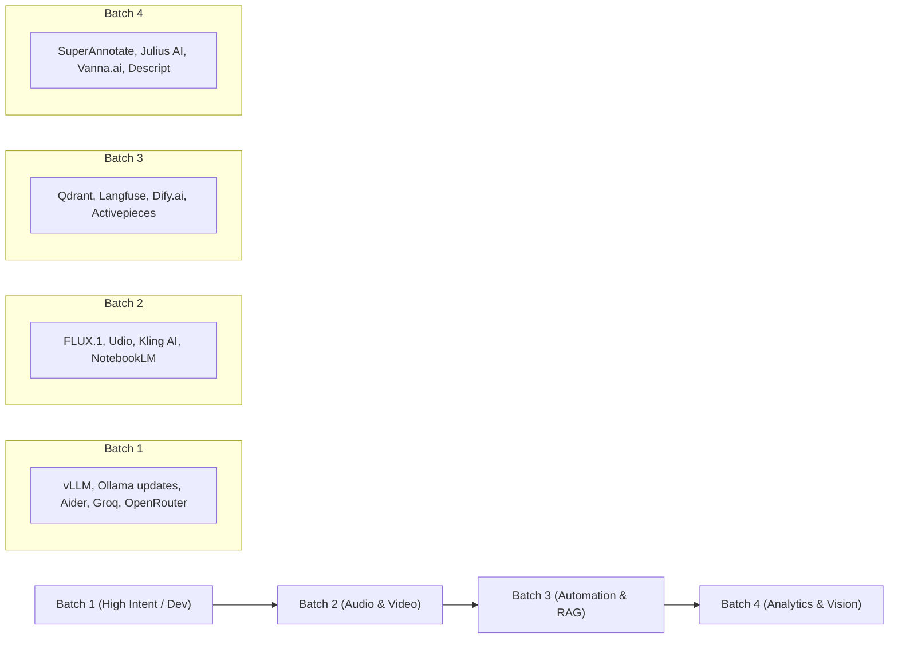

# Prother.dev - Curated Tool Directory Pipeline & Recommendations
*A comprehensive backlog of high-signal, practitioner-grade AI tools mapped across Prother's 7 primary taxonomy categories.*

---

## 1. Executive Summary & Selection Criteria

This curation backlog is compiled for **Prother.dev** to capture high-intent developer and operator search traffic, enable high-value comparison showdowns, and preserve the directory's anti-slop standard.

Every tool in this backlog clears the **Six Published Listing Standards (S1-S6)**:
- **S1 (Live & Accessible)**: The tool is in active production with self-serve signup or download. No closed waitlists or concept flyers.
- **S2 (AI-Native)**: AI represents the fundamental value proposition, not an incidental afterthought.
- **S3 (Complete Listing)**: Clean naming, transparent pricing structure, working documentation, and links.
- **S4 (Honest Presentation)**: No deceptive free labeling where a trial requires a credit card or paywalls after three prompts.
- **S5 (Safe & Legal)**: Commercial licensing clear, adhering to model provider terms and privacy standards.
- **S6 (English Listing)**: Listing metadata and documentation available in clear English.

---

## 2. Master Category Breakdown & Tool Pipeline

```
  ┌────────────────────────────────────────────────────────┐
  │                 7 PRIMARY CATEGORIES                   │
  ├────────────────────────────────────────────────────────┤
  │ 1. Developer Frameworks & Infrastructure (dev-platforms)│
  │ 2. Generative Content Creation (generative-content)    │
  │ 3. Automation & Workflow Orchestration (automation)    │
  │ 4. Conversational AI & Research (conversational-ai)    │
  │ 5. NLP & Text Utilities (nlp-text)                     │
  │ 6. Computer Vision (computer-vision)                   │
  │ 7. Data Analytics & Predictive Modeling (data-analytics)│
  └────────────────────────────────────────────────────────┘
```

---

### Category 1: Developer Frameworks & Infrastructure (`dev-platforms`)
*Category Focus: Model training, high-throughput serving, RAG plumbing, vector stores, and AI-first code environments.*

| Tool Name | Slug | Pricing Model | Starting Price | Has API | Status | Strategic Value & Key Differentiator |
| :--- | :--- | :--- | :--- | :--- | :--- | :--- |
| **Cursor** | `cursor` | Freemium | $20 / month | Yes | **Added & Live** | VS Code fork featuring Composer for multi-file edits, codebase indexing, and tab autocomplete. |
| **Windsurf** | `windsurf` | Freemium | $15 / month | Yes | **Added & Live** | Codeium's agentic IDE powered by the Cascade agent and low-latency Supercomplete typing. |
| **Aider** | `aider` | Open Source | $0 (BYOK) | Yes | **Added & Live** | Terminal-based AI pair programming CLI with git integration and benchmark-leading code editing. |
| **vLLM** | `vllm` | Open Source | $0 | Yes | **Added & Live** | High-throughput open-source LLM inference and serving engine utilizing PagedAttention. |
| **Open WebUI** | `open-webui` | Open Source | $0 | Yes | **Added & Live** | Feature-rich self-hosted UI for Ollama, OpenAI-compatible backends, RAG, and multi-user setups. |
| **LiteLLM** | `litellm` | Open Source | $0 / Usage proxy| Yes | Ready for Intake | Universal I/O proxy providing 100+ LLMs in standardized OpenAI-compatible API format with rate limiting. |
| **Groq** | `groq` | Freemium | Pay-as-you-go | Yes | Ready for Intake | Ultra-fast LPU inference engine serving open-weight models (Llama 3, Gemma) at 300+ tokens/second. |
| **OpenRouter** | `openrouter` | Paid (Usage) | Pay-as-you-go | Yes | Ready for Intake | Unified API gateway for commercial and open models with automatic fallback, routing, and crypto/card billing. |
| **Qdrant** | `qdrant` | Open Source | Free / $25/mo | Yes | Ready for Intake | High-performance open-source vector database written in Rust with binary quantization and payload filtering. |
| **Langfuse** | `langfuse` | Open Source | Free / $59/mo | Yes | Ready for Intake | Open-source LLM observability, prompt versioning, session tracing, and evaluation toolkit. |

#### Detailed Specifications (Category 1)

#### Aider (`aider`)
- **Website**: `https://aider.chat`
- **GitHub**: `https://github.com/paul-gauthier/aider`
- **Tagline**: Terminal-based AI pair programming in your git repository
- **Pricing**: Open Source (Free, MIT licensed; you supply model API keys)
- **Key Use Cases**: CLI pair programming, automated git commits with formatted messages, multi-file refactoring in terminal sessions.
- **Alternatives**: `cursor`, `windsurf`

#### vLLM (`vllm`)
- **Website**: `https://vllm.ai`
- **GitHub**: `https://github.com/vllm-project/vllm`
- **Tagline**: High-throughput and memory-efficient LLM serving engine
- **Pricing**: Open Source (Apache 2.0; you provide compute hardware)
- **Key Use Cases**: Production model serving, continuous batching for multi-user apps, self-hosting open weights at enterprise throughput.
- **Alternatives**: `ollama`, `replicate`

#### Open WebUI (`open-webui`)
- **Website**: `https://openwebui.com`
- **GitHub**: `https://github.com/open-webui/open-webui`
- **Tagline**: Self-hosted, extensible AI interface for local and cloud models
- **Pricing**: Open Source (MIT licensed)
- **Key Use Cases**: Private corporate chat portal, internal model testing, multi-user document RAG on local hardware.
- **Alternatives**: `chatgpt`, `poe`, `ollama`

#### LiteLLM (`litellm`)
- **Website**: `https://litellm.ai`
- **GitHub**: `https://github.com/BerriAI/litellm`
- **Tagline**: Call 100+ LLM APIs using the OpenAI format with load balancing
- **Pricing**: Open Source (Free core library; enterprise proxy pricing available)
- **Key Use Cases**: Multi-provider fallback, budget tracking per team, unified API gateway across Azure, Bedrock, and Anthropic.
- **Alternatives**: `langchain`, `openrouter`

#### Groq (`groq`)
- **Website**: `https://groq.com`
- **Tagline**: LPU inference engine for real-time generative computing
- **Pricing**: Freemium (Generous free tier with rate limits, pay-as-you-go commercial API)
- **Key Use Cases**: Real-time voice agent backends, instantaneous search synthesis, high-speed structured JSON parsing.
- **Alternatives**: `replicate`, `openrouter`

#### OpenRouter (`openrouter`)
- **Website**: `https://openrouter.ai`
- **Tagline**: A unified interface for LLMs with transparent model routing
- **Pricing**: Paid (Pure usage-based billing per million input/output tokens)
- **Key Use Cases**: Model fallback routing, cost optimization by selecting cheaper providers, global prepaid API wallets.
- **Alternatives**: `replicate`, `groq`

#### Qdrant (`qdrant`)
- **Website**: `https://qdrant.tech`
- **GitHub**: `https://github.com/qdrant/qdrant`
- **Tagline**: Vector database and semantic search engine in Rust
- **Pricing**: Open Source (Apache 2.0 self-hosted; Managed cloud starts at $25/mo with free tier)
- **Key Use Cases**: High-scale semantic retrieval, hybrid dense and sparse search, low-latency recommendations.
- **Alternatives**: `pinecone`

#### Langfuse (`langfuse`)
- **Website**: `https://langfuse.com`
- **GitHub**: `https://github.com/langfuse/langfuse`
- **Tagline**: Open-source LLM observability, tracing, and prompt management
- **Pricing**: Open Source (Self-hosted MIT; Cloud free tier plus $59/mo team tier)
- **Key Use Cases**: Debugging multi-step agent trajectories, cost and latency tracking per user, regression prompt evaluations.
- **Alternatives**: `langchain`

---

### Category 2: Generative Content Creation (`generative-content`)
*Category Focus: Image, video, audio, 3D, and voice generation from prompts.*

| Tool Name | Slug | Pricing Model | Starting Price | Has API | Status | Strategic Value & Key Differentiator |
| :--- | :--- | :--- | :--- | :--- | :--- | :--- |
| **FLUX.1** | `flux-1` | Open Source / Paid | Free weights / API | Yes | Ready for Intake | Black Forest Labs state-of-the-art open-weights image generator, outperforming Midjourney. |
| **Udio** | `udio` | Freemium | Free / $10/mo | No | Ready for Intake | Breakthrough AI music generation engine with realistic vocals; primary competitor to Suno. |
| **Kling AI** | `kling` | Freemium | Free / $10/mo | Yes | Ready for Intake | Frontier video generation tool with remarkable prompt coherence and physical simulation. |
| **Luma Dream Machine**| `luma-dream-machine` | Freemium | Free / $29.99/mo | Yes | Ready for Intake | High-speed generative video with cinematic camera controls and smooth motion. |
| **Pika** | `pika` | Freemium | Free / $10/mo | Yes | Ready for Intake | Creative generative video platform featuring effects such as Squish, Melt, Explode, and Inflate. |
| **Magnific AI** | `magnific-ai` | Paid | $39 / month | No | Ready for Intake | Hallucinatory image upscaler and detail enhancer tailored for commercial concept artists. |

#### Detailed Specifications (Category 2)

#### FLUX.1 (`flux-1`)
- **Website**: `https://blackforestlabs.ai`
- **Tagline**: State-of-the-art text-to-image suite by Black Forest Labs
- **Pricing**: Open Source / Paid (FLUX Schnell Apache 2.0, FLUX Dev non-commercial, FLUX Pro via API)
- **Key Use Cases**: Photorealistic image generation, typography and legible text rendering in images, local ComfyUI workflows.
- **Alternatives**: `midjourney`, `adobe-firefly`

#### Udio (`udio`)
- **Website**: `https://udio.com`
- **Tagline**: Create high-fidelity music tracks with vocals from text prompts
- **Pricing**: Freemium (Free tier with monthly credits; Standard plan is $10/month)
- **Key Use Cases**: Full track production, game soundtrack drafting, genre blending, stem generation.
- **Alternatives**: `suno`

#### Kling AI (`kling`)
- **Website**: `https://klingai.com`
- **Tagline**: High-definition video generation with cinematic camera motion
- **Pricing**: Freemium (Daily free credits; Standard plan starts at $10/month)
- **Key Use Cases**: Storyboarding, commercial video B-roll, realistic character movement and action scenes.
- **Alternatives**: `runway`

#### Luma Dream Machine (`luma-dream-machine`)
- **Website**: `https://lumalabs.ai/dream-machine`
- **Tagline**: Next-generation video and camera generation model
- **Pricing**: Freemium (30 free generations/mo; Standard plan starts at $29.99/mo)
- **Key Use Cases**: Drone camera simulation, continuous shot transitions, rapid video concept prototyping.
- **Alternatives**: `runway`, `kling`

#### Pika (`pika`)
- **Website**: `https://pika.art`
- **Tagline**: Idea-to-video platform with playful physical modification effects
- **Pricing**: Freemium (Initial free credits; Standard plan starts at $10/month)
- **Key Use Cases**: Social media video clips, stylized animation, visual physics effects.
- **Alternatives**: `runway`, `kling`

#### Magnific AI (`magnific-ai`)
- **Website**: `https://magnific.ai`
- **Tagline**: AI image upscaler and hallucinatory detail generator
- **Pricing**: Paid (Starts at $39/month; no ongoing free tier)
- **Key Use Cases**: Print-ready upscaling, game texture enhancement, restoration of low-resolution renders.
- **Alternatives**: `adobe-firefly`

---

### Category 3: Automation & Workflow Orchestration (`automation`)
*Category Focus: Multi-step workflows, app-to-app integration, and headless browser agents.*

| Tool Name | Slug | Pricing Model | Starting Price | Has API | Status | Strategic Value & Key Differentiator |
| :--- | :--- | :--- | :--- | :--- | :--- | :--- |
| **Dify.ai** | `dify` | Open Source | Free / $59/mo | Yes | Ready for Intake | Visual LLM application development platform with RAG pipelines, agents, and team workspaces. |
| **Activepieces** | `activepieces` | Open Source | Free / $10/mo | Yes | Ready for Intake | Open-source alternative to Zapier focused on privacy, self-hosting, and AI piece connectors. |
| **Flowise** | `flowise` | Open Source | $0 (Self-hosted) | Yes | Ready for Intake | Drag-and-drop visual UI for orchestrating LangChain components and autonomous agents. |
| **Browserbase** | `browserbase` | Paid (Usage) | $20 / month | Yes | Ready for Intake | Developer platform for headless browser automation purpose-built for autonomous AI agents. |

#### Detailed Specifications (Category 3)

#### Dify.ai (`dify`)
- **Website**: `https://dify.ai`
- **GitHub**: `https://github.com/langgenius/dify`
- **Tagline**: Open-source platform for building production-ready LLM apps
- **Pricing**: Open Source (Self-hosted Apache 2.0; Cloud sandbox free, Team plan $59/mo)
- **Key Use Cases**: Visual multi-agent workflows, internal knowledge base RAG bots, backend API publishing.
- **Alternatives**: `n8n`, `langchain`

#### Activepieces (`activepieces`)
- **Website**: `https://activepieces.com`
- **GitHub**: `https://github.com/activepieces/activepieces`
- **Tagline**: Open-source business automation with native AI capabilities
- **Pricing**: Open Source (MIT licensed; Cloud starter $10/mo)
- **Key Use Cases**: On-premise webhook automation, enterprise compliance pipelines, CRM data sync.
- **Alternatives**: `zapier`, `make`, `n8n`

#### Flowise (`flowise`)
- **Website**: `https://flowiseai.com`
- **GitHub**: `https://github.com/FlowiseAI/Flowise`
- **Tagline**: Drag and drop UI to build customized LLM flows
- **Pricing**: Open Source (MIT licensed; zero licensing cost self-hosted)
- **Key Use Cases**: Visual agent prototyping, quick LangChain node testing, visual RAG pipeline construction.
- **Alternatives**: `langchain`, `dify`

#### Browserbase (`browserbase`)
- **Website**: `https://browserbase.com`
- **Tagline**: The headless browser platform built for AI agents
- **Pricing**: Paid (Developer plan starts at $20/month with usage-based scaling)
- **Key Use Cases**: Bypassing captchas for web scraping agents, running persistent browser sessions, session replays.
- **Alternatives**: `bardeen`

---

### Category 4: Conversational AI & Research (`conversational-ai`)
*Category Focus: Assistants, verified answer engines, grounded literature discovery, and customer agents.*

| Tool Name | Slug | Pricing Model | Starting Price | Has API | Status | Strategic Value & Key Differentiator |
| :--- | :--- | :--- | :--- | :--- | :--- | :--- |
| **NotebookLM** | `notebooklm` | Free | $0 | No | Ready for Intake | Google source-grounded research assistant with conversational Audio Overviews. |
| **Consensus** | `consensus` | Freemium | Free / $11.99/mo | Yes | Ready for Intake | AI academic search engine searching 200M+ research papers with evidence synthesis. |
| **Elicit** | `elicit` | Freemium | Free / $12/mo | Yes | Ready for Intake | Literature review assistant extracting structured findings and methodology comparisons. |
| **Grok** | `grok` | Paid | $8 / month | Yes | Ready for Intake | xAI conversational assistant with real-time X/Twitter data access and vision reasoning. |

#### Detailed Specifications (Category 4)

#### NotebookLM (`notebooklm`)
- **Website**: `https://notebooklm.google`
- **Tagline**: Grounded personalized AI notebook powered by Gemini 1.5
- **Pricing**: Free (Included with standard Google accounts)
- **Key Use Cases**: Document-grounded question answering, generating dual-host podcast Audio Overviews, study guides.
- **Alternatives**: `perplexity`, `chatgpt`

#### Consensus (`consensus`)
- **Website**: `https://consensus.app`
- **Tagline**: Search 200M+ scientific papers to get evidence-based answers
- **Pricing**: Freemium (Unlimited basic searches; Premium plan is $11.99/month billed annually)
- **Key Use Cases**: Medical and scientific claim verification, literature discovery, finding consensus metrics on hypotheses.
- **Alternatives**: `perplexity`, `elicit`

#### Elicit (`elicit`)
- **Website**: `https://elicit.com`
- **Tagline**: The AI research assistant for literature review and paper analysis
- **Pricing**: Freemium (5,000 one-time credits free; Plus plan starts at $12/month)
- **Key Use Cases**: Screening research papers, extracting tabular data from PDFs, systematic review synthesis.
- **Alternatives**: `consensus`, `perplexity`

#### Grok (`grok`)
- **Website**: `https://x.ai`
- **Tagline**: Frontier conversational model with real-time news access
- **Pricing**: Paid (Requires X Premium subscription starting at $8/month; API billed separately)
- **Key Use Cases**: Real-time breaking news analysis, unfiltered conversational queries, image comprehension.
- **Alternatives**: `chatgpt`, `perplexity`

---

### Category 5: NLP & Text Utilities (`nlp-text`)
*Category Focus: Summarization, translation, transcription, grammar, and prompt programming.*

| Tool Name | Slug | Pricing Model | Starting Price | Has API | Status | Strategic Value & Key Differentiator |
| :--- | :--- | :--- | :--- | :--- | :--- | :--- |
| **Whisper** | `whisper` | Open Source | $0 / $0.006/min | Yes | Ready for Intake | OpenAI benchmark speech recognition and translation model with widespread adoption. |
| **Descript** | `descript` | Freemium | Free / $12/mo | No | Ready for Intake | Document-style video and podcast editor featuring studio sound, filler removal, and overdub. |
| **Wordware** | `wordware` | Freemium | Free / $49/mo | Yes | Ready for Intake | Web-based IDE treating natural language as code for building reliable multi-agent pipelines. |
| **Writer** | `writer` | Paid | $18 / user / mo | Yes | Ready for Intake | Enterprise full-stack generative platform with proprietary Palmyra models and brand guardrails. |

#### Detailed Specifications (Category 5)

#### Whisper (`whisper`)
- **Website**: `https://openai.com/research/whisper`
- **GitHub**: `https://github.com/openai/whisper`
- **Tagline**: General-purpose speech recognition and translation model
- **Pricing**: Open Source (MIT licensed weights; Hosted OpenAI API is $0.006 per minute)
- **Key Use Cases**: Video captioning, podcast transcription, meeting summaries, speech-to-text translation.
- **Alternatives**: `otter-ai`, `deepl`

#### Descript (`descript`)
- **Website**: `https://descript.com`
- **Tagline**: Video and audio editing as simple as working in a word doc
- **Pricing**: Freemium (Free tier includes 1 transcription hour/mo; Hobbyist plan starts at $12/mo)
- **Key Use Cases**: Text-based video editing, automatic filler word removal, voice clone overdubs.
- **Alternatives**: `otter-ai`, `elevenlabs`

#### Wordware (`wordware`)
- **Website**: `https://wordware.ai`
- **Tagline**: The web IDE for programming with natural language and AI agents
- **Pricing**: Freemium (Generous free tier; Pro plan is $49/month)
- **Key Use Cases**: Building structured agent APIs, chaining complex prompts, sharing executable workflows.
- **Alternatives**: `langchain`, `notion-ai`

#### Writer (`writer`)
- **Website**: `https://writer.com`
- **Tagline**: Full-stack generative AI platform for enterprise organizations
- **Pricing**: Paid (Starts at $18/user/month; Custom enterprise pricing)
- **Key Use Cases**: Corporate brand voice governance, automated marketing copy review, contract summarization.
- **Alternatives**: `grammarly`, `notion-ai`

---

### Category 6: Computer Vision (`computer-vision`)
*Category Focus: Image and video classification, object detection, data annotation, and visual perception.*

| Tool Name | Slug | Pricing Model | Starting Price | Has API | Status | Strategic Value & Key Differentiator |
| :--- | :--- | :--- | :--- | :--- | :--- | :--- |
| **SuperAnnotate** | `superannotate` | Paid | Contact / Free tier | Yes | Ready for Intake | End-to-end multimodal annotation platform with automated QA and fine-tuning. |
| **LandingLens** | `landinglens` | Freemium | Free trial / Paid | Yes | Ready for Intake | Andrew Ng's LandingAI platform for industrial visual inspection and defect detection. |
| **Viam** | `viam` | Freemium | Free / Usage | Yes | Ready for Intake | Modular software platform managing edge hardware, computer vision sensors, and robotics. |

#### Detailed Specifications (Category 6)

#### SuperAnnotate (`superannotate`)
- **Website**: `https://superannotate.com`
- **Tagline**: Multimodal data annotation and model fine-tuning platform
- **Pricing**: Paid (Free sandbox available; Commercial plans priced on dataset volume)
- **Key Use Cases**: High-precision polygon segmentation, video frame labeling, multimodal LLM RLHF alignment.
- **Alternatives**: `label-studio`, `roboflow`

#### LandingLens (`landinglens`)
- **Website**: `https://landing.ai`
- **Tagline**: Computer vision platform built for manufacturing and industrial QA
- **Pricing**: Freemium (Free tier includes 100 images; Pay-as-you-go commercial tiers)
- **Key Use Cases**: Factory defect classification, surface scratch detection, automated assembly line checks.
- **Alternatives**: `roboflow`, `clarifai`

#### Viam (`viam`)
- **Website**: `https://viam.com`
- **Tagline**: Software platform for smart machines, edge cameras, and robotics
- **Pricing**: Freemium (Generous free tier with $20/mo platform credit; usage-based compute)
- **Key Use Cases**: Edge computer vision inference, IoT camera automation, robotics navigation.
- **Alternatives**: `roboflow`, `viso-suite`

---

### Category 7: Data Analytics & Predictive Modeling (`data-analytics`)
*Category Focus: Forecasting, warehouse BI copilots, CRM intelligence, and data exploration.*

| Tool Name | Slug | Pricing Model | Starting Price | Has API | Status | Strategic Value & Key Differentiator |
| :--- | :--- | :--- | :--- | :--- | :--- | :--- |
| **Julius AI** | `julius-ai` | Freemium | Free / $20/mo | No | Ready for Intake | Conversational data analyst analyzing Excel, CSVs, and generating statistical charts. |
| **Vanna.ai** | `vanna-ai` | Open Source | $0 / Cloud tiers | Yes | Ready for Intake | Open-source Python RAG framework for accurate, context-aware Text-to-SQL generation. |
| **Definite** | `definite` | Paid | $100 / month | Yes | Ready for Intake | AI-native data platform combining database sync, semantic models, and spreadsheet canvas. |

#### Detailed Specifications (Category 7)

#### Julius AI (`julius-ai`)
- **Website**: `https://julius.ai`
- **Tagline**: Your AI data analyst for spreadsheets and structured datasets
- **Pricing**: Freemium (15 free messages/mo; Basic plan starts at $20/month)
- **Key Use Cases**: CSV trend analysis, automated Python chart generation, linear regressions, data cleaning.
- **Alternatives**: `hex`, `polymer`

#### Vanna.ai (`vanna-ai`)
- **Website**: `https://vanna.ai`
- **GitHub**: `https://github.com/vanna-ai/vanna`
- **Tagline**: Open-source SQL generation using RAG on your database schema
- **Pricing**: Open Source (MIT licensed; Free community tier and enterprise hosted plans)
- **Key Use Cases**: Connecting natural language to Postgres/Snowflake/BigQuery, embedding SQL copilots in apps.
- **Alternatives**: `hex`, `tableau-pulse`

#### Definite (`definite`)
- **Website**: `https://definite.app`
- **Tagline**: AI-powered data warehouse and reporting canvas
- **Pricing**: Paid (Team plans starting at $100/month)
- **Key Use Cases**: Automated dashboard construction, cross-database reporting, natural language data exploration.
- **Alternatives**: `hex`, `tableau-pulse`

---

## 3. Top 10 Comparison Pairs Unlocked

Adding this curated roster activates the highest-converting comparison pages on Prother:

1. **`/compare?a=cursor&b=windsurf`** (The premier battle for AI-first code editors)
2. **`/compare?a=suno&b=udio`** (Generative AI music generation showdown)
3. **`/compare?a=pinecone&b=qdrant`** (Managed serverless vector DB vs open-source Rust engine)
4. **`/compare?a=perplexity&b=notebooklm`** (Broad web research vs grounded source documents)
5. **`/compare?a=adobe-firefly&b=flux-1`** (Enterprise IP indemnification vs open-weights visual fidelity)
6. **`/compare?a=n8n&b=activepieces`** (Self-hosted node workflows vs lightweight open Zapier)
7. **`/compare?a=ollama&b=vllm`** (Local desktop inference vs high-concurrency production serving)
8. **`/compare?a=elevenlabs&b=whisper`** (Voice synthesis leader vs speech-to-text standard)
9. **`/compare?a=roboflow&b=superannotate`** (Developer vision platform vs enterprise multimodal labeling)
10. **`/compare?a=hex&b=julius-ai`** (Collaborative engineering notebook vs conversational spreadsheet analyst)

---

## 4. Intake Priority Matrix

To execute additions in batches, follow this phased priority order:



- **Batch 1 (Immediate)**: `vllm`, `aider`, `groq`, `openrouter` (highest search volume from developers).
- **Batch 2 (Generative Media)**: `flux-1`, `udio`, `kling`, `notebooklm` (strong consumer and social interest).
- **Batch 3 (Infra & Workflows)**: `qdrant`, `langfuse`, `dify`, `activepieces` (critical enterprise/builder utility).
- **Batch 4 (Specialized Utilities)**: `superannotate`, `julius-ai`, `vanna-ai`, `descript` (completing domain depth).
